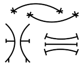

# matrix-eno-bot

`matrix-eno-bot` is a [Matrix](https://matrix.org) bot based on the Python 3 bot template [nio-template](https://github.com/8go/nio-template) which in turn is based on the Matrix Python SDK called [matrix-nio](https://github.com/poljar/matrix-nio). The bot, the template and the SDK are all written in Python 3. The commands that the `matrix-eno-bot` comes with are written in `bash` and in `python3`.

## Naming: Eno?

Why `eno`? It is a word play. Yes, another word play. `Matrix` is a word play on the [Matrix movies](https://en.wikipedia.org/wiki/The_Matrix_(franchise)). `matrix-nio` one would guess is a word play on the character [Neo](https://en.wikipedia.org/wiki/Neo_(The_Matrix)), in the Matrix movies. Both `Neo` and `nio` sound the same. They are [homophones](https://en.wikipedia.org/wiki/Homophone). And `eno` is just a randomized version of `Neo`, an [anagram](https://en.wikipedia.org/wiki/Anagram) of Neo.

Eno is also another name for the [Ibibio tribe](https://en.wikipedia.org/wiki/Ibibio_people) in Nigeria. Have a look at their unusual symbols.



Hence, the "logo" which is nothing more than an Nsibidi symbol taken from [Wikipedia](https://en.wikipedia.org/wiki/Ibibio_people). To me the Nsibidi symbol chosen for the logo resembles a stylized `E`. `E` of course for `eno`.

And a month after creating this repo by pure chance, this [Urban Dictionary link](https://www.urbandictionary.com/define.php?term=Eno) for `eno` popped up. Here, the word `eno` is defined as: _Totally awesome, Wicked cool. Hyperbole of awesome/cool. E.g. Dude, that round of speedball was so eno!_ What a fitting coincidence! Perfect fit! So cool, oops, so eno!


## Installation and Setup

```
# install dependencies, matrix-nio
# for more detail see https://github.com/poljar/matrix-nio
sudo apt install python3 python3-requests libolm-dev
pip install -r requirements.txt
# install matrix-eno-bot
git clone https://github.com/8go/matrix-eno-bot
# https://github.com/8go/matrix-eno-bot includes the nio-template files.
# no need to clone nio-template repo
cd matrix-eno-bot
# configure bot basics
cp config.yaml.example config.yaml
vim config.yaml # adjust the config file to your needs
# configure bot command dictionary (applause and thanks to @wolterhv)
# first, read all the comments in commands.yaml.example
# then adjust the "paths"
# then (optionally) add your own commands at the end of the file
cp commands.yaml.example commands.yaml
vim commands.yaml # adjust paths, add your custom commands
# make scripts executable
chmod 755 eno/scripts/*
# configure bot as service
cd eno
cp matrix-eno-bot.service.example matrix-eno-bot.service
vim matrix-eno-bot.service # adjust service to your setup
sudo cp matrix-eno-bot.service /etc/systemd/system/matrix-eno-bot.service
# read the comments in matrix-eno-bot.service, it tells you what to do
systemctl enable matrix-eno-bot # let bot autostart at boot
systemctl start matrix-eno-bot # start bot
systemctl stop matrix-eno-bot # stop bot
```

Other hints:
- Create an account for your bot in some client, e.g. in Element
- Use this account (username, password) in `config.yaml` and let the bot create a `brand-new` device
  - If device is not new e2ee will not work!
- Verify the bot via emoji-verify
- If desired reconfigure `config.yaml` to replace password with access token for added security


## Installation as Docker Container

Since a couple of Python packages require to be compiled, you might want to not 
install `gcc` on your server. An alternate way to quickly deploy the bot is to compile 
it in a docker container and then install the Docker container.

- To build the Docker image (~500mb): `docker build -t matrix-eno-bot --rm .`
- To run the container: `docker run --rm -ti matrix-eno-bot bash`

Thanks and :clap: to @apiraino for this contribution!


## Usage

- intended audience/users:
  - small homeserver set up for a few friends
  - tinkerers who want to learn how a bot works
  - people who want to play around with Python code and Matrix
- create a Matrix account for the bot, name it `bot` for example
- configure the bot software
- create the bot service and start the bot or the bot service
- log in to the before created Matrix `bot` account e.g. via Element web page
- manually send invite from `bot` account to a friend (or to yourself)
- once invite is accepted, reset the bot service (so that the new room will be added to bot service)
  - if you as admin already have a room with the bot, you can reset the bot by sending it `restart bot` as a message in your Matrix bot room
- have the newly joined invitee send a `hello` command to the bot for a first test
- bot can do emoji verify
- bot can handle encrypted rooms by default
- bot can handle texts, images, and arbitrary files (send audio, PDF, video, etc.)

## Feedback, Give it a :star:

- If you like the `matrix-eno-bot` please give it a :star: on Github right away, so that others can find it more easily. Thanks :heart: !
- Raise issues or contribute a PR. :thumbsup: to those who have already done so!
- :heart: and :clap: to contributors @wolterhv, @apiraino, @troglodyne, etc.


## Debugging

Run something similar to
```
cd matrix-eno-bot # go to your installation directory
vim config.yaml # modify the logging parameters, increase logging
systemctl restart matrix-eno-bot # restart server in case it is running
# observe debug output and look at the log files
```

## Bot as Personal Assistant: Example bot commands provided

Commands useful to average users:

- btc: gives Bitcoin BTC price info
- ddg: search the web with DuckDuckGo search
- eth: gives Ethereum price info
- hello: gives you a friendly compliment
- help: to list available bot commands
- hn: read Hacker News, fetches front page headlines from Hacker News
- mn: read Messari News, fetches the latest news articles from Messari
- motd: gives you the Linux Message Of The Day
- rss: read RSS feeds
- s2f: print Bitcoin Stock-to-flow price info
- tides: get today's low and high tides of your favorite beach
- totp: get 2FA Two-factor-authentication TOTP One-Time-Password PIN via bot message (like Google Authenticator)
- twitter: read latest user tweets from Twitter (does **not** work most of the time as info is scraped from web)
- waves: get the surf report of your favorite beach
- weather: get the weather forecast for your favorite city
- web: surf the web, get a web page (JavaScript not supported)

- easily extendable via command dictionary in convenient commands.yaml file
 
## Bot as Admin Tool: Example bot commands provided to Matrix or system administrators

With these commands a system administrator can maintain his Matrix installation and keep a watchful eye on his server all through the Matrix bot. Set the permissions accordingly in the config file to avoid unauthorized use of these bot commands!

- alert: shows if any CPU, RAM, or Disk thresholds have been exceeded (best to combine with a cron job, and have the cron job send the bot message to Matrix admin rooms)
- backup: runs your backup script to backup files, partitions, etc.
- check: check status, health status, updates, etc. of bot, Matrix and the operating system
- cputemp: monitor the CPU temperatures
- date: gives date and time of server
- disks: see how full your disks or mountpoints are
- firewall: list the firewall settings and configuration
- platform: gives hardware and operating system platform information
- ps: print current CPU, RAM and Disk utilization of server
- restart: restart the bot itself, or Matrix services
- top: gives 5 top CPU and RAM consuming processes
- update: update operating sytem and other software environments
- users: list user accounts that exist on your server
- wake: wake up other PCs on the network via wake-on-LAN

- easily extendable via command dictionary in convenient commands.yaml file


## Other Features

- sample scripts are in `bash` and in `python3`, but can be in any language (JavaScript, Go, Microsoft .bat files, etc.)
- easily extendable via command dictionary in convenient commands.yaml configuration file
  - This means that you can modify this bot without any programming knowledge or knowledge of Python.
  - The user can add new commands simple by editing a text file. So new commands can be added via configuration, rather than via programming.
  - :clap: for the excellent work of @wolterhv, :thumbsup:
- scripts or programs have access to the name of the sender. 
  - The user with name "@john:server.org" sends the text (command) `hello` to the bot. The bot can respond by using the name of the sender, i.e. the 
    bot could respond with "Hi @john:server.org, how are you today?". The name of the sender is stored in the enviroment variable `ENO_SENDER` available
    to all scripts or programs. 
    Look at script [hello.sh](https://github.com/8go/matrix-eno-bot/blob/master/eno/scripts/hello.sh) to see an example of how it can be used. 
  - :clap: for the PR by @troglodyne :thumbsup:
- matrix-eno-bot combines well with [matrix-commander](https://github.com/8go/matrix-commander). Configure `matrix-commander` as another eno bot device.
- `matrix-commander` can then be used very easily for monitoring the system. An admin can set up a cron job that runs every 15 minutes, e.g. to check CPU temperature, or to check a log file for signs of an intrusion (e.g. SSH or Web Server log files). If anything abnormal is found by the cron job, the cron job fires off a bot message to the admin.
- matrix-eno-bot and `matrix-commander` can share all of the "commands" or scripts


## Legal

There is no support and no warranty.


## History and Past

The first version of the bot was [tiny-matrix-bot plus](https://github.com/8go/tiny-matrix-bot) which was based on [matrix-python-sdk](https://github.com/matrix-org/matrix-python-sdk). Since `matrix-python-sdk` is no longer actively supported and end-to-end-encryption comes out of the box in `matrix-nio`, the switch to `nio-template` was made. 
The [nio-template](https://github.com/anoadragon453/nio-template) is a template for creating bots with
[matrix-nio](https://github.com/poljar/matrix-nio). The documentation for
matrix-nio can be found
[here](https://matrix-nio.readthedocs.io/en/latest/nio.html). 
For up-to-date info on `nio-template` go to https://github.com/anoadragon453/nio-template.
Give them a :star: if you like it. They deserve :clap:.

[tiny-matrix-bot plus](https://github.com/8go/tiny-matrix-bot) is now abandonded and all efforts are put into `matrix-eno-bot`.

Due to this history, you will find strong similarieties in the Bash scripts in [tiny-matrix-bot plus](https://github.com/8go/tiny-matrix-bot) and `eno`.

`eno` includes various modifications and enhancements in comparison to [nio-template](https://github.com/8go/nio-template). `nio-template` was forked in summer of 2020. Since then my fork has drifted apart from the original `nio-template`. The framework files of `nio-template` used by `eno` have these enhancements:

- use of access token instead of password
- option to trust own devices
- option to change device name
- emoji verification and handling of `to_device` messages
- sending of images and files (audio, video, pdf, etc.)
- adding commands and customization through the editing of a text file rather than editing Python code. 


## Final Thoughts

- Thanks a lot to the people that have already contributed! It is so appreciated! :heart:
- Enjoy and have fun with it, it is cool, and easily extensible. Adjust it to your needs!
- Pull Requests on :octocat: are welcome :)  See feature-requests on `isuues` page for ideas.


---


# Very Rough Project Code Overview

I am not keeping this overview very up to date. So some portions might be out-of-date.
This is just to give you a rough idea of how the code is structured.

### `main.py`

Initialises the config file, the bot store, and nio's AsyncClient (which is
used to retrieve and send events to a matrix homeserver). It also registering
some callbacks on the AsyncClient to tell it to call some functions when
certain events are received (such as an invite to a room, or a new message in a
room the bot is in).

It also starts the sync loop. Matrix clients "sync" with a homeserver, by
asking constantly asking for new events. Each time they do, the client gets a
sync token (stored in the `next_batch` field of the sync response). If the
client provides this token the next time it syncs (using the `since` parameter
on the `AsyncClient.sync` method), the homeserver will only return new event
*since* those specified by the given token.

This token is saved and provided again automatically by using the
`client.sync_forever(...)` method.

_It can also change its device name and it can trust its own devices,
if so configured._

### `config.py`

This file reads a config file at a given path (hardcoded as `config.yaml` in
`main.py`), processes everything in it and makes the values available to the
rest of the bot's code so it knows what to do. Most of the options in the given
config file have default values, so things will continue to work even if an
option is left out of the config file. Obviously there are some config values
that are required though, like the homeserver URL, username, access token etc.
Otherwise the bot can't function.

### `storage.py`

Creates (if necessary) and connects to a SQLite3 database and provides commands
to put or retrieve data from it. Table definitions should be specified in
`_initial_setup`, and any necessary migrations should be put in
`_run_migrations`. There's currently no defined method for how migrations
should work though.

### `callbacks.py`

Holds callback methods which get run when the bot get a certain type of event
from the homserver during sync. The type and name of the method to be called
are specified in `main.py`. Currently there are two defined methods, one that
gets called when a message is sent in a room the bot is in, and another that
runs when the bot receives an invite to the room.

The message callback function, `message`, checks if the message was for the
bot, and whether it was a command. If both of those are true, the bot will
process that command.

The invite callback function, `invite`, processes the invite event and attempts
to join the room. This way, the bot will auto-join any room it is invited to.

_The device callback function, `device`, handles all aspects of an emoji
verification._

### `bot_commands.py`

Where the bot's (currently) two built-in commands are defined: `help` 
and `reload`.

A `Command` object is created when a message comes in that's recognised as a
command from a user directed at the bot (either through the specified command
prefix (defined by the bot's config file), or through a private message
directly to the bot. The `process` command is then called for the bot to act on
that command.

In `process` function, the commands will be recognized via their 
regular expression signature. 
If a regular expression matches the input, the corresponding command
is called. User commands are not implemented here, but configured 
through the `commands.yaml` config file. See, `commands.yaml.example`.


### `message_responses.py`

Where responses to messages that are posted in a room (but not necessarily
directed at the bot) are specified. `callbacks.py` will listen for messages in
rooms the bot is in, and upon receiving one will create a new `Message` object
(which contains the message text, amongst other things) and calls `process()`
on it, which can send a message to the room as it sees fit.

A good example of this would be a Github bot that listens for people mentioning
issue numbers in chat (e.g. "We should fix #123"), and the bot sending messages
to the room immediately afterwards with the issue name and link.

### `chat_functions.py`

A separate file to hold helper methods related to messaging. Mostly just for
organisational purposes. Currently just holds `send_text_to_room`, a helper
method for sending formatted messages to a room.

_Other helper functions allow sending of images and arbitrary files like
audio, video, PDFs, etc._

### `errors.py`

Custom error types for the bot. Currently there's only one special type that's
defined for when a error is found while the config file is being processed.

### `command_dict.py`

Commands are nearly exclusively specified in a Yaml config file `commands.yaml`.
This yaml file is read and internally a dictionary structure is created holding
all the information specified in `commands.yaml`. This file has a class that 
implements all operations necessary on this command dictionary.

### `config.yaml.example`

The sample configuration file. People running your bot should be advised to
copy this file to `config.yaml`, then edit it according to their needs. Be sure
never to check the edited `config.yaml` into source control since it'll likely
contain sensitive details like passwords!

### `commands.yaml.example`

The sample commands file. People running your bot should be advised to
copy this file to `commands.yaml`, then edit it according to their needs. 
Here is where users can specify new commands, simply by editing a text file
(in Yaml format). No knowledge of Python is needed. 

